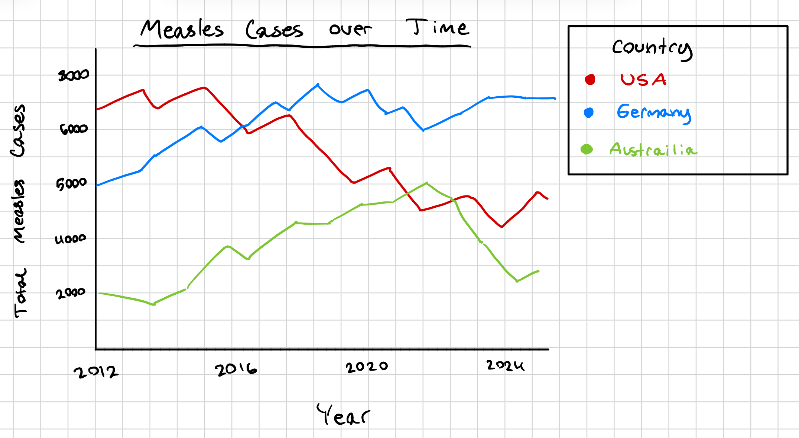
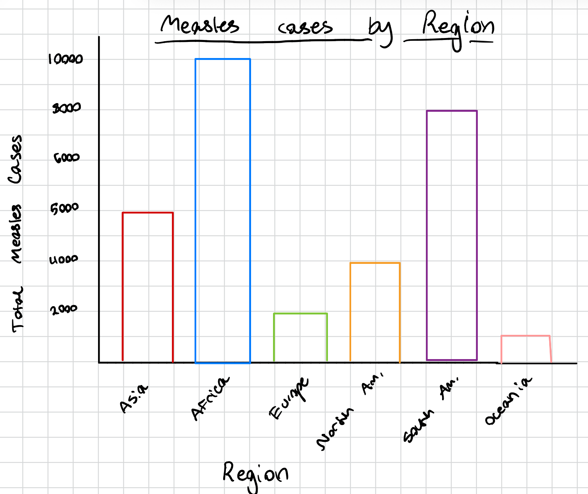

## Table of Contents:
- [Week 1](#Week-1)   
- [Week 2](#Week-2)


## Load Libraries   

```{r}
library(tidyverse)
library(gt)

```

# Week 1

## Loading in the Data

```{r}
# reading in from github
cases_month <- readr::read_csv('https://raw.githubusercontent.com/rfordatascience/tidytuesday/main/data/2025/2025-06-24/cases_month.csv')
cases_year <- readr::read_csv('https://raw.githubusercontent.com/rfordatascience/tidytuesday/main/data/2025/2025-06-24/cases_year.csv')
```

## Data Description

The following data concerns measles and rubella cases. The data was from the World Health Organization (WHO) between 2012 and June 6, 2025. This includes monthly and yearly data across multiple countries grouped into WHO regions, where each row corresponds to a specific country within a region. The data is provisional and is early case reports by WHO member countries collected using each countries national surveillance systems. The data contains several types of case confirmations (suspected, clinical, epidemiologically linked, and lab confirmed) as well as population count data in the yearly data set. The data was collected to monitor measles and rubella cases worldwide in order to support public health decision making and vaccination strategies.

## Cleaning Performed

The given CSVs are cleaned mostly through formatting and data type conversions. All variable names have been standardized into all lowercase with underscores. In the cases_month dataset, numeric variables were converted from a string to have a proper numeric type. In cases_year dataset, the first row was removed because it contained a duplicate header. Column names were also changed for simplicity (iso_country_code -\> iso3 for example). Additionally, the dataset contains derived variables such as total measles and rubella cases and incidence rates per 100000 people.

## Research Questions

**To be answered by the data:**

-   How does the volume of measles cases change over time?

-   Which areas of the world contribute the most to measles cases?

**To be answered using supplemental data:**

-   How does vaccination rates affect measles cases by country? (using vaccination data sets likely from WHO)

-   Are measles case rates correlated with GPD and development level of a country? (get GDP and country data from somewhere like gapminder)

## Sketches of Possible Plots

{fig-align="center"}

    


# Week 2  

## Unmodified data summaries  

- Using cases_month, is there monthly variation in the univariate statistics of lab confirmed measels/rubella cases?  

```{r}


```


